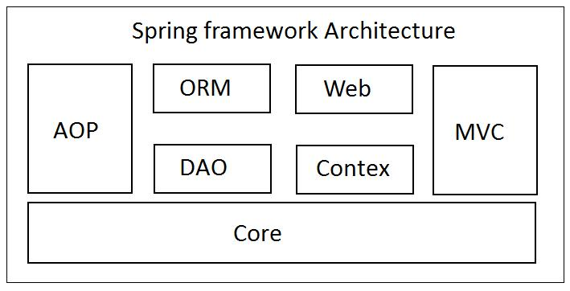

# Spring Framework

## Spring Core

## Features

- Core:
    - Bean Life Cycle
    - Dependency Injection
    - Inversion of Control
    - Bean Factory and Application Context

## Tech

- [Java](https://bell-sw.com/pages/downloads/) - Java is a powerful general-purpose programming language-

- [Spring](https://spring.io) - The Spring Framework is an application framework and inversion of control container for the Java platform.

- [Intellij Idea](https://www.jetbrains.com/idea/) - IntelliJ IDEA is an Integrated Development Environment (IDE) for
  JVM languages designed to maximize developer productivity.

- [Lombok](https://projectlombok.org/download) - Project Lombok (from now on, Lombok) is an annotation-based Java
  library that allows you to reduce boilerplate code.

